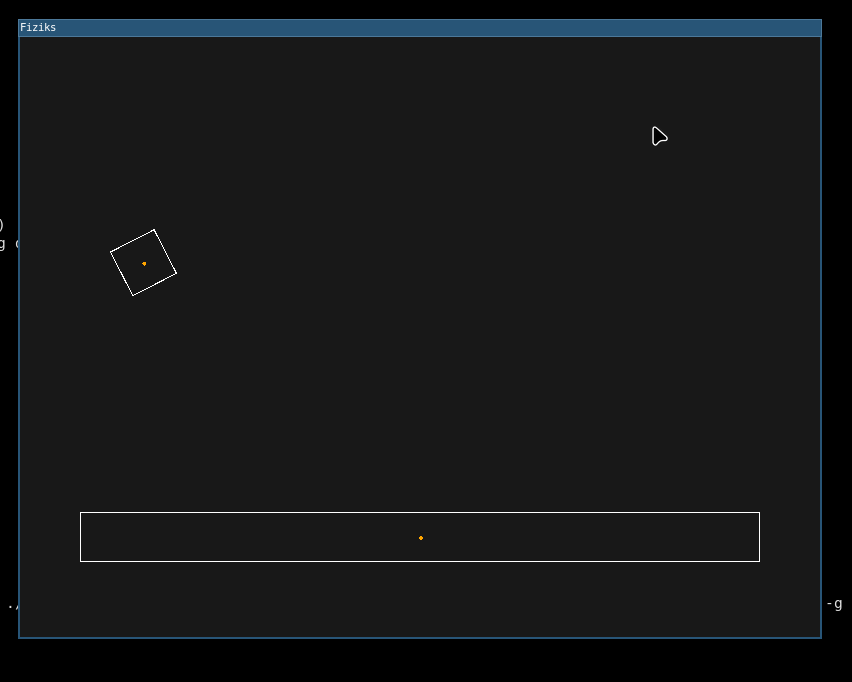
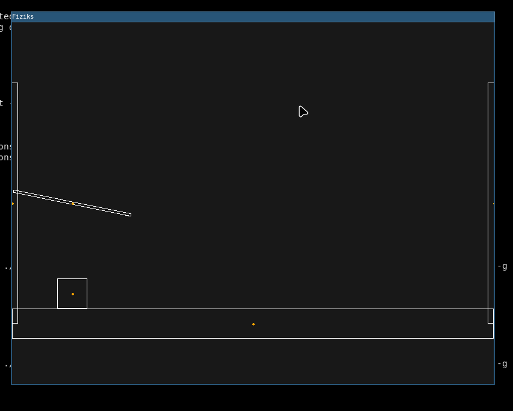

# Fiziks Engine
A 2d basic physics engine built for edicational purposes 

## Preview
simple 2d box physics
---

   
      

very stable sim
---

   
  

## Todo
- [ ] time travel
- [ ] improve broad collision
- [ ] friction
- [ ] circles
- [ ] demos
