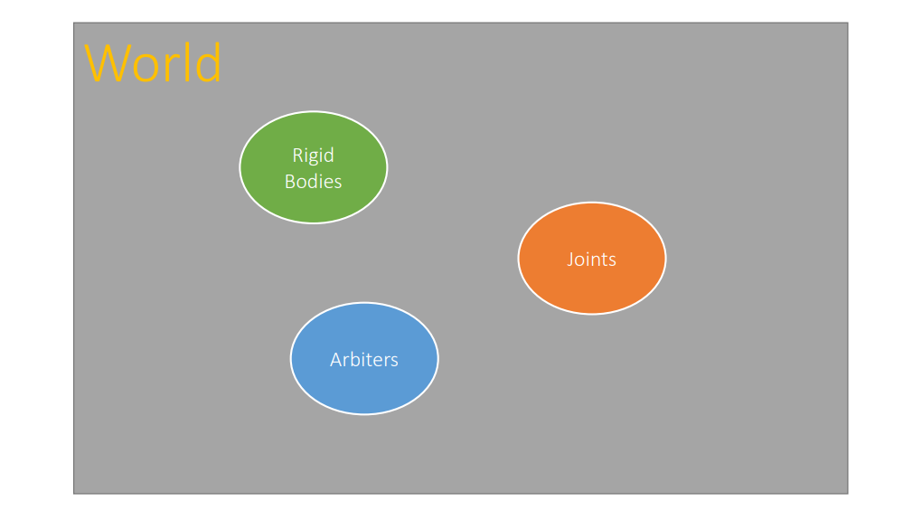
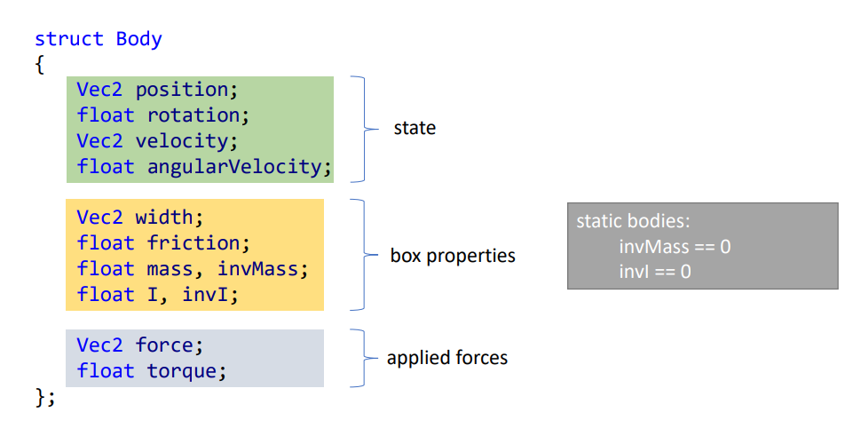
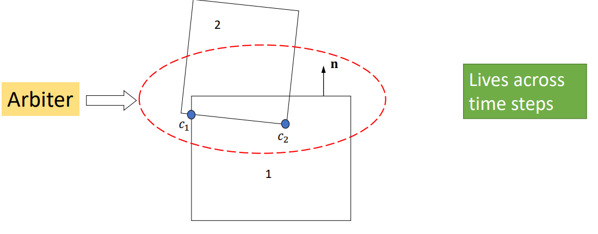
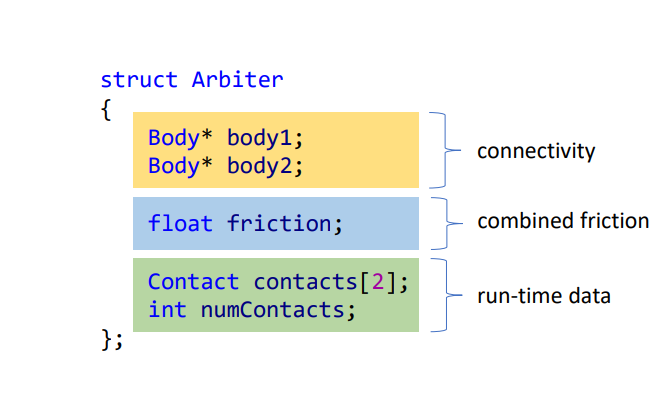
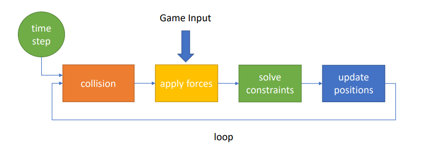
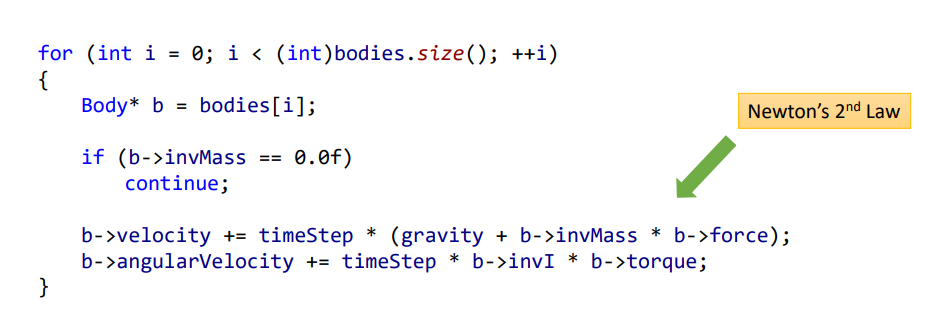
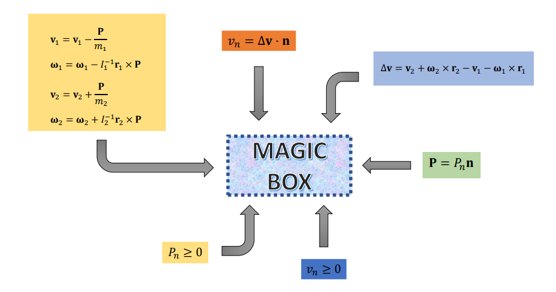
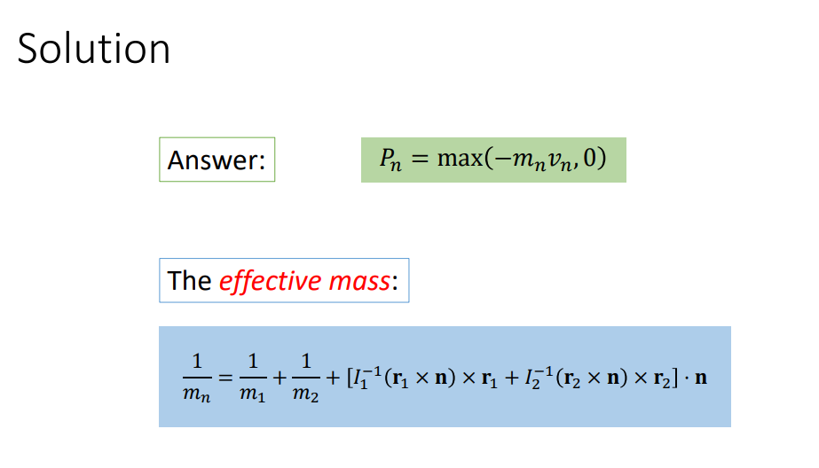

# Introduction

## Index
- HowDoPhysicsEnginesWork
- chrishecker Rigid body dynamics    

[HowDoPhysicsEnginesWork](https://github.com/erincatto/box2d-lite/blob/master/docs/HowDoPhysicsEnginesWork.pdf)
---

to simulate physics you need a program that simulates **Newtonian physics**, and **collision detection** program.    

two types of physics sims, **rigid body** and soft body sims, i only care about rigid body sims, it groups objects into categories based on shapes and how they should interact.     

          
world: rigid bodies, joints, arbiters      

- rigid bodies: the bodies in the simlations boxes, circles , polygones....      
       
 
- arbiter: struct that contains data about the contact points of two bodies       
<center>
<span>
    
</span>
<span>
    
</span>
</center>


#### The Holy Simlation Loop
       

- **Collision**
    - 2 phases broad and narrow
    - they are split so we can optimize
    - broad phase just loops through all the bodies and applies narrow collision check
    - narrow collision checks body by body collision, finds the collision points, creates arbiters

- **Forces**
    - apply newton 2 law       
          


- **Solve contrains**
    - collision resolution
    - find the relative velecity in contact point **Delta v = Dv**,solve Vn = normal * Dv >= 0
    - to solve it. find impulse **P** that makes Vn >= 0, we know dir its the normal, we need to find magnitude **Pn** >= 0 (push not pull)
    - once you find it apply it, ,to change the velocity directly     
          
    - **magic box meth**     
          
    - **Solution**      
          
    
- **Update position**       
    - change rotation and position using the new vel and angular vel      
            
    - reset the forces, and torque (2d rotational force i think)      

- **Left out details**
    - Friction
    - Overlap removal
    - Joints
    - Solver Convergence


[chrishecker Rigid body dynamics](https://www.chrishecker.com/Rigid_Body_Dynamics) 
---

physics is a vast field, we dont need to learn it all because we not going to use all of it, we only care about a subset which is rigid body dynamics.     
its closely related to **kinematics**:  the study of movement over time not concering it self with what caused the movement in the first place.    
joints are objects that connect rigid bodies togther, if we wanna model a human we need a collection of rigid bodies in addition to joints to connect them.    


```
    F = dp/dt = d(mv)/dt = m dv/dt = m * a
```
p: linear momentum    
F: force

